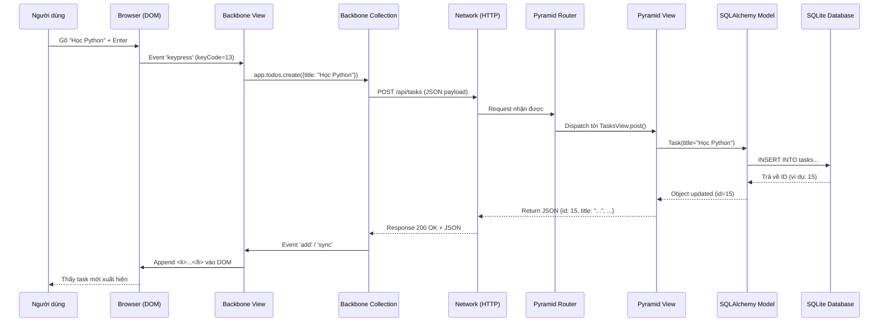

# Quy trình Full-Stack: Từ Browser xuống Database và ngược lại

Tài liệu này mô tả chi tiết từng bước một của dữ liệu đi từ hành động của người dùng, qua các lớp mạng, backend, database và quay trở lại cập nhật giao diện.

Chúng ta sẽ lấy ví dụ cụ thể: **Người dùng thêm mới task "Học Python"**.

## Sơ đồ Sequence (Tuần tự)



---

## Chi tiết từng bước (Step-by-Step)

### Giai đoạn 1: Frontend (Client-side)

**Bước 1: Sự kiện người dùng (User Event)**
- **Vị trí**: `todox/static/js/views/app.js`
- **Hành động**: Người dùng focus vào ô input `#new-todo`, gõ "Học Python" và nhấn Enter.
- **Code**:
  ```javascript
  // AppView lắng nghe sự kiện keypress
  events: {
      'keypress #new-todo': 'createOnEnter',
      // ...
  }
  ```

**Bước 2: Xử lý Logic View (`createOnEnter`)**
- **Vị trí**: `todox/static/js/views/app.js`
- **Logic**:
  1. Kiểm tra xem phím ấn có phải là Enter (13) không?
  2. Lấy giá trị input: `this.$input.val().trim()` -> `"Học Python"`.
  3. Gọi Collection để tạo mới:
     ```javascript
     app.todos.create({
         title: "Học Python",
         order: app.todos.nextOrder(),
         completed: false
     });
     ```

**Bước 3: Backbone Collection Sync**
- **Vị trí**: `todox/static/js/collections/todos.js`
- **Cơ chế**: Hàm `.create()` của Backbone thực hiện 2 việc song song:
  1. **Optimistic UI**: Thêm ngay một model tạm vào collection (để giao diện có thể hiện ngay lập tức nếu muốn).
  2. **API Call**: Tự động gửi một AJAX Request tới server dựa trên thuộc tính `url: '/api/tasks'`.

### Giai đoạn 2: Network & Backend (Server-side)

**Bước 4: HTTP Request**
- **Giao thức**: HTTP/1.1
- **Method**: `POST`
- **URL**: `http://localhost:6543/api/tasks`
- **Headers**: `Content-Type: application/json`
- **Body**: `{"title": "Học Python", "order": 1, "completed": false}`

**Bước 5: Pyramid Router Dispatch**
- **Vị trí**: `todox/__init__.py`
- **Cơ chế**: Pyramid nhận request, so khớp URL `/api/tasks` với bảng định tuyến.
  ```python
  config.add_route('tasks', '/api/tasks')
  ```
- Nó tìm thấy route tên `tasks` và chuyển request tới view được cấu hình xử lý route này.

**Bước 6: View Logic Execution**
- **Vị trí**: `todox/views.py` -> Class `TasksView`, method `post`.
- **Code**:
  ```python
  @view_config(request_method='POST')
  def post(self):
      json_data = self.request.json_body # {"title": "Học Python", ...}
      title = json_data.get('title')
      
      # Khởi tạo Model SQLAlchemy
      new_task = Task(title=title)
      DBSession.add(new_task)
      
      # Flush để bắt buộc DB ghi nhận và sinh ID
      DBSession.flush() 
      
      return new_task.to_json()
  ```

### Giai đoạn 3: Database Interaction

**Bước 7: ORM & SQL Execution**
- **Thư viện**: SQLAlchemy, zope.sqlalchemy
- **Hành động**: `DBSession.flush()` biến đổi object Python thành câu lệnh SQL:
  ```sql
  INSERT INTO tasks (title, completed, created_at) 
  VALUES ('Học Python', 0, '2026-02-18 10:00:00')
  ```
- **Kết quả**: Database (SQLite) thực thi lệnh, sinh ra **ID** mới (ví dụ: `15`). SQLAlchemy cập nhật ngược lại vào object `new_task.id = 15`.

**Bước 8: Serialization & Response**
- **Vị trí**: `todox/views.py`
- **Code**: `new_task.to_json()` chuyển object thành dictionary:
  ```python
  {
      'id': 15, 
      'title': 'Học Python', 
      'completed': False, 
      'created_at': '...'
  }
  ```
- Pyramid `renderer='json'` tự động chuyển dict này thành chuỗi JSON string và gửi về client với status code `200 OK`.

### Giai đoạn 4: Quay về Frontend

**Bước 9: Backbone cập nhật Model**
- **Vị trí**: Bên trong thư viện Backbone (ẩn dưới nền).
- **Cơ chế**: 
  - Backbone nhận phản hồi JSON từ server chứa `id: 15`.
  - Nó tìm model tạm (đã tạo ở Bước 3) và cập nhật `id` thật từ server vào đó.
  - Lúc này model đã được "đồng bộ hóa" (synced).

**Bước 10: Sự kiện giao diện (UI Render)**
- **Vị trí**: `todox/static/js/views/app.js`
- **Sự kiện**: Khi Collection có thêm phần tử mới (`add event`), `AppView` đã đăng ký lắng nghe:
  ```javascript
  this.listenTo(app.todos, 'add', this.addOne);
  ```
- **Hàm `addOne`**:
  1. Tạo một `TodoView` mới (`todox/static/js/views/todo.js`) cho task "Học Python".
  2. Render template HTML `<li>...</li>`.
  3. Append (chèn) vào danh sách `<ul> #todo-list`.

**Kết quả**: Người dùng thấy dòng "Học Python" hiện ra cuối danh sách. Toàn bộ quy trình thường diễn ra trong vài chục mili giây (ms).
